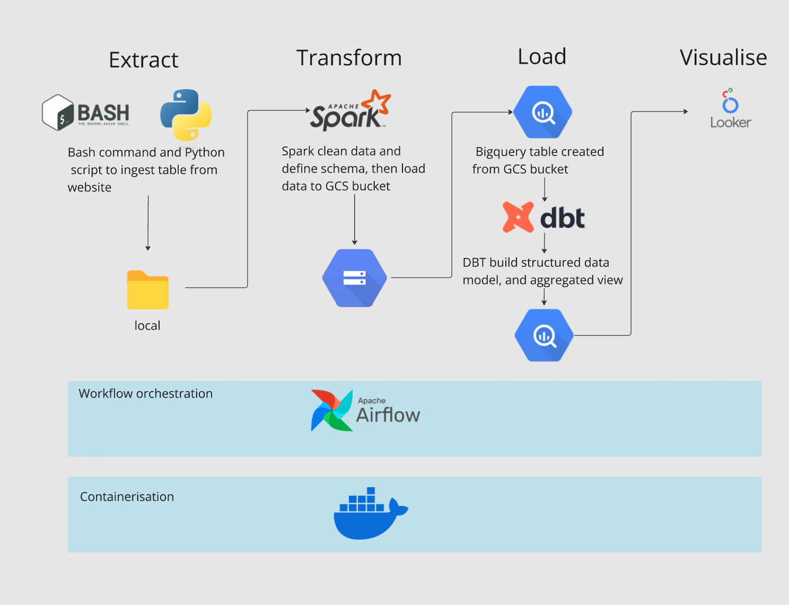
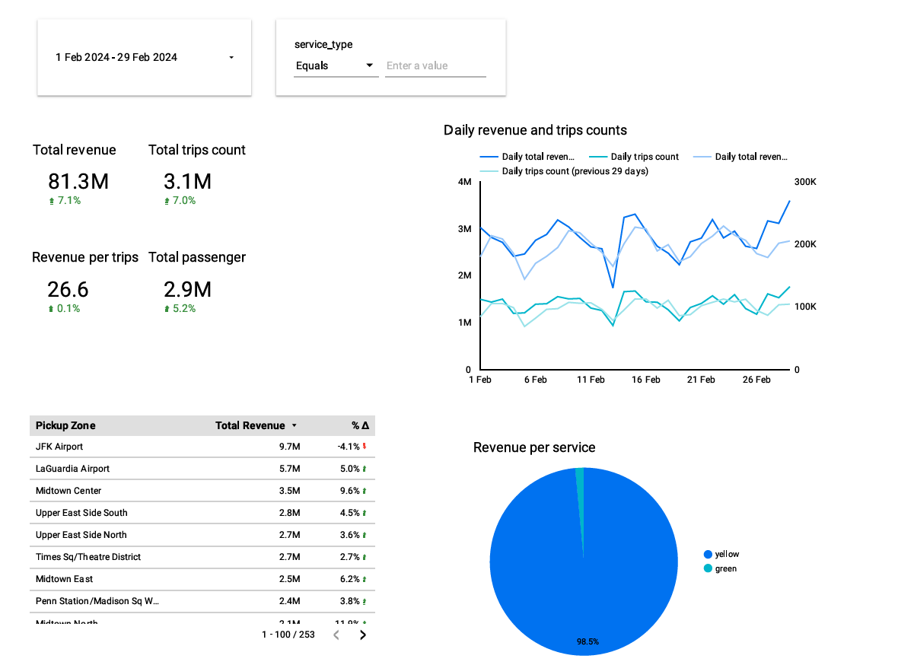
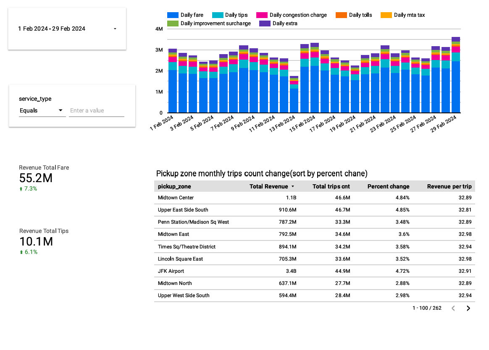

# Project info
This project tried to build a ETL process for new york taxi data,  and develop a dashboard to analyse revenue change. 
The aim of this project is mainly to practise all the things I learned from course [Data Engineer Zoomcamp](https://github.com/DataTalksClub/data-engineering-zoomcamp)   

# Tech tools
- Airflow -- control ETL process  
- Docker -- configure env  
- Spark -- clean and oragnise data  
- Bigquery -- datawarehouse  
- Looker -- dashborad

# Presentation
### Page 1 -- NY Taxi Monthly Revenue Overview

### Page 2 -- NY TAXI Monthly Revenue Detail

